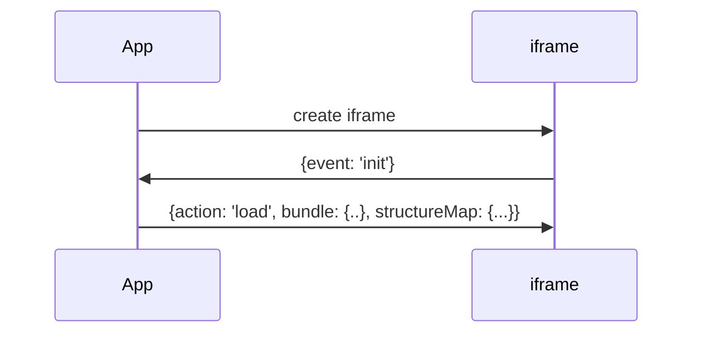
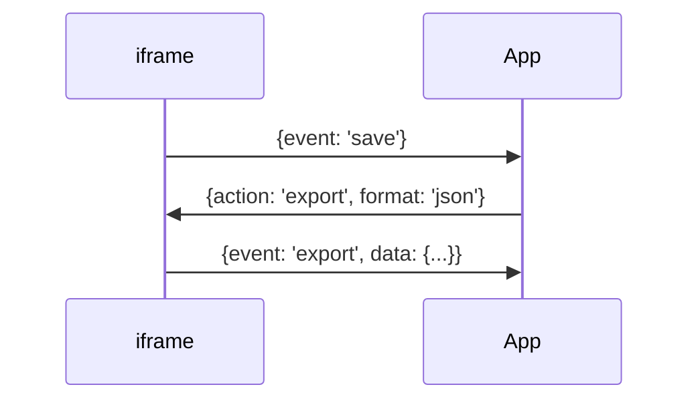

# FML

This project was generated with [Angular CLI](https://github.com/angular/angular-cli) version 15.2.1.

## Development server

Run `ng serve` for a dev server. Navigate to `http://localhost:4200/`. The application will automatically reload if you change any of the source files.

## Build

Run `ng build` to build the project. The build artifacts will be stored in the `dist/` directory.

## Run inside of iframe

Create iframe element inside your application with url to FML editor.

The communication between iframe and your application is done using [window.postMessage()](https://developer.mozilla.org/en-US/docs/Web/API/Window/postMessage).

### Initialization

### Saving

