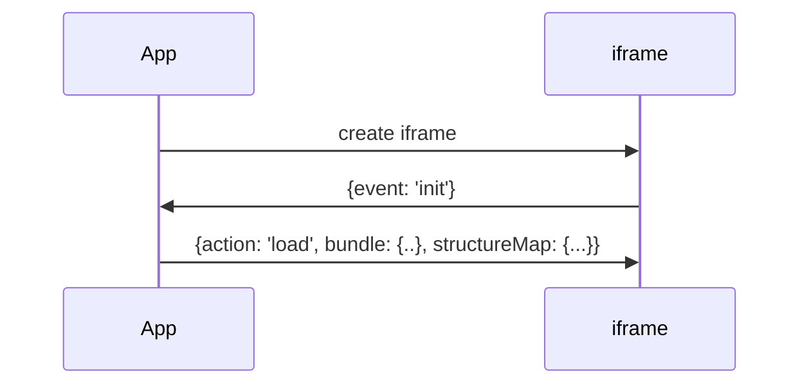
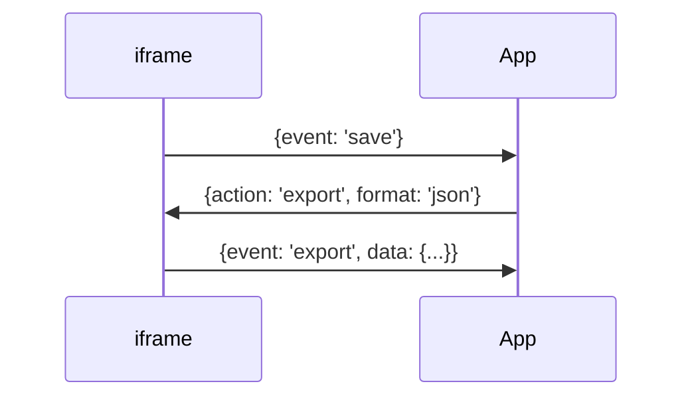

# FML

This project was generated with [Angular CLI](https://github.com/angular/angular-cli) version 15.2.1.

## Development server

Run `ng serve` for a dev server. Navigate to `http://localhost:4200/`. The application will automatically reload if you change any of the source files.

## Build

Run `ng build` to build the project. The build artifacts will be stored in the `dist/` directory.

## Running inside an Iframe

To run the FML editor within your application, follow these steps:

1. Create an iframe element within your application.
2. Provide the URL to the FML editor within this iframe.
3. Establish communication between the iframe and your application using [window.postMessage()](https://developer.mozilla.org/en-US/docs/Web/API/Window/postMessage).

This approach allows seamless interaction between the iframe and your application.

### Initialization

The editor within the iframe will send an `init` event when it's ready to proceed with further actions.

To initialize the FML editor, the client should supply it with the `bundle`, `structure map` and optionally, `contained resources` using the `load` action.

### Saving
The `save` event is triggered when the user clicks the 'Save' button in the FML editor. 

To save data, the client should send the `export` action. Optionally, the save format can be provided. If no format is given, the default one is used. 

Once the data is prepared and ready for export, the FML editor sends the `export` event with a StructureMap object as data.

